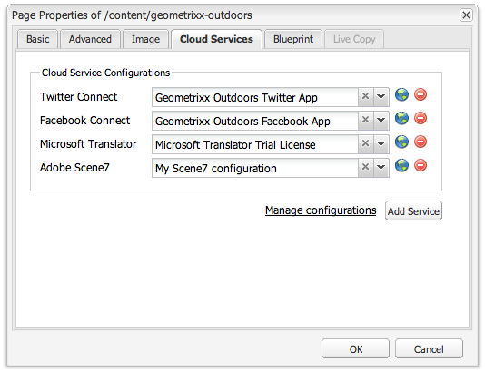

# Adding Scene7 Features to your Page{#adding-scene-features-to-your-page}

[Adobe Scene7](https://help.adobe.com/en_US/scene7/using/WS26AB0D9A-F51C-464e-88C8-580A5A82F810.html) is a hosted solution for managing, enhancing, publishing, and delivering rich media assets to Web, mobile, email, and Internet-connected displays and print.

You can view AEM assets published in Scene7 in various viewers:

* Zoom
* Flyout
* Video
* Image Template
* Image

You can publish digital assets directly from AEM to Scene7 and you can publish digital assets from Scene7 to AEM.  

This document describes how to publish digital assets from AEM to Scene7 and vice versa. Viewers are also described in detail. For information on configuring AEM for Scene7, see [Integrating Scene7 with AEM](/help/sites-administering/scene7.md).  

See also [Adding Image Maps](/assets/using/image-maps.md).  

For more information on using video components with AEM, see the following:

* [Video](/sites/classic-ui-authoring/using/manage-assets-classic-s7-video.md)

>[!NOTE]
>
>If Scene7 assets do not display properly, please make sure that Dynamic media is [disabled](../../../assets/using/config-dynamic.md#disabling-dynamic-media) and then refresh the page.

## Manually Publishing to Scene7 from Assets {#manually-publishing-to-scene-from-assets}

You can publish digital assets to Scene7 either from the Assets console in the classic UI or directly from the asset.

>[!NOTE]
>
>AEM publishes to Scene7 asynchronously. After you click **Publish**, it may take several seconds for your asset to publish to Scene7.
>

### Publishing from the Assets console {#publishing-from-the-assets-console}

To publish to Scene7 from the Assets console if the assets are in a Scene7 target folder:

1. In the AEM classic UI, click** Digital Assets** to access the digital asset manager.  

1. Select the asset (or assets) or folder from within the target folder you want to publish to Scene7 and right-click and select **Publish to Scene7**. Alternatively, you can select** Publish to Scene7 **from the **Tools **menu**. **

   

1. Go to Scene7 and confirm that the assets are available.

   >[!NOTE]
   >
   >If the assets are not in a Scene7 synchronized folder, **Publish to Scene7** in both menus is visible but disabled.

### Publishing from an asset {#publishing-from-an-asset}

You can manually publish an asset as long as that asset is located inside the synchronized Scene7 folder.

>[!NOTE]
>
>If the asset is not located in the Scene7 synchronized folder, the link to **Publish to Scene7** will not appear.

To publish to Scene7 directly from a digital asset:

1. In AEM, click **Digital Assets** to access the digital asset manager.  

1. Double-click to open an asset.  

1. In the asset details pane, select **Publish to Scene7**.

   

1. The link changes to **Publishing ...** and then **Published**. Go to Scene7 and confirm that the asset is available.

   >[!NOTE]
   >
   >If the asset does not publish properly to Scene7, the link changes to **Publishing Failed**. If the asset has already been published to Scene7, the link reads **Re-Publish to Scene7**. Republishing allows you to make changes to an asset in AEM and re-publish them.

### Publishing assets from outside the CQ Target folder {#publishing-assets-from-outside-the-cq-target-folder}

Adobe recommends that you publish assets to Scene7 only from assets within the Scene7 target folder. However, if you need to upload assets from a folder outside of the target folder, you can still do that by uploading them to an **ad-hoc** folder on Scene7.

You do this by first configuring the Cloud configuration for the page where the asset will appear. You then add a Scene7 component to the page and drag and drop an asset on the component. After the page properties are set for that page, a **Publish to Scene7** link appears that when selected triggers uploading to Scene7.

>[!NOTE]
>
>Assets that are in the ad-hoc folder do not appear in the Scene7 Content Browser.

To publish assets that reside outside the CQ target folder:

1. In AEM in the classic UI, click **Websites** and navigate to the web page that you want to add a digital asset to that is not yet published to Scene7. (Normal page inheritance rules apply.)  

1. In the sidekick, click the **Page** icon and click **Page Properties**.  

1. Click **Cloud Services** and click **Add services **and select **Scene7**.
1. In the** Adobe Scene7 **drop-down list, select the desired configuration and click **OK**.

   

1. On the web page, add a Scene7 component to the desired location on the page.
1. From the content finder, drag a digital asset to the component. You see a link to **Check Scene7 Publication Status**.

   >[!NOTE]
   >
   >If the digital asset is in the CQ target folder, then no link to **Check Scene7 Publication Status** appears. The assets is simply placed in the component.

   

1. Click **Check Scene7 Publication Status**. If the assets is not published, AEM publishes the asset to Scene7. After it is uploaded, the asset is located in the ad-hoc folder. By default, the ad-hoc folder is located in the **name_of_the_company/CQ5_adhoc**. You can [configure this, if needed](#configuringtheadhocfolder).

   >[!NOTE]
   >
   >If the asset is not in a Scene7 synchronized folder and there is no Scene7 cloud configuration associated to the current page, the upload will fail.

## Scene7 Components {#scene-components}

The following Scene7 components are available in AEM:

* Zoom
* Flyout (Zoom)
* Image Template
* Image
* Video

>[!NOTE]
>
>These components are not available by default and need to be selected in Design mode before using.

After they are made available in Design mode, you can add the components to your page like any other AEM component. Assets that have not yet been published to Scene7 are published to Scene7 if in a synchronized folder or on a page or with a Scene7 cloud configuration.

>[!NOTE]
>
>If you are creating and developing custom S7 viewers and using the Content Finder, you need to explicity add the **allowfullscreen** parameter.

### Flash Viewers End-of-Life Notice {#flash-viewers-end-of-life-notice}

Effective January 31, 2017, Adobe Scene7 will officially end-of-life support for the Flash viewer platform.

For more information about this important change, see [Flash Viewer End-of-Life FAQs](https://docs.adobe.com/content/docs/en/aem/6-1/administer/integration/marketing-cloud/scene7/flash-eol.html).

### Adding a Scene7 Component to a Page {#adding-a-scene-component-to-a-page}

Adding a Scene7 component to a page is the same as adding a component to any page. Scene7 components are described in detail in the following sections.

To add a Scene7 component/viewer to a page in the classic UI:

1. In AEM, open the page where you want to add the Scene7 component.  

1. If no Scene7 components are available, click the ruler in the sidekick to enter **Design** mode, click **Edit** parsys, and select all the **Scene7** components to make them available.  

1. Return to **Edit** mode by clicking the the pencil in the sidekick.  

1. Drag a component from the **Scene7** group in the sidekick onto the page in the desired location.  

1. Click **Edit** to open the component.  

1. Edit the component as necessary and click **OK** to save changes.

### Adding interactive viewing experiences to a responsive website {#adding-interactive-viewing-experiences-to-a-responsive-website}

Responsive design for your assets means that your assets adapts depending on where it is displayed. With responsive design, the same assets can be effectively displayed on multiple devices.

To add an interactive viewing experience to a responsive site in the classic UI:

1. Log in to AEM, and ensure that you have [configured Adobe Scene7 Cloud Services](/help/sites-administering/scene7.md#configuring-scene-integration) and that Scene7 components are available.

   >[!NOTE]
   >
   >If Scene7 WCM components are not available, be sure to enable them via Design mode.

1. In a website with the Scene7 components enabled, drag an **Image** viewer to the page.
1. Edit the component and adjust the breakpoints in the **Scene7 Settings** tab.

   

1. Confirm that the viewers are responsively resizing and that all interactions are optimized for desktop, tablet, and mobile.

### Settings common to all Scene7 components {#settings-common-to-all-scene-components}

Although configuration options vary, the following are common to all Scene7 components:

* **File Reference **- Browse to a file that you want to reference. File reference shows the asset URL and not necessarily the full Scene7 URL including the URL commands and parameters. You cannot add Scene7 URL commands and parameters in this field. They have to be added through the corresponding functionality in the component.
* **Width** - Lets you set the width.
* **Height** - Lets you set the height.

You set these configuration options by opening (double-clicking) a Scene7 component, for example, when you open a **Zoom** component:

 

### Zoom {#zoom}

The HTML5 Zoom component displays a larger image when you press the + button.

The asset has zoom tools at the bottom. Click **+** to enlarge. Click **-** to reduce. Clicking the **x** or the reset zoom arrow brings the image back to the original size it was imported as. Click the diagonal arrows to make it full screen. Click **Edit** to configure the component. With this component, you can configure [settings common to all Scene7 components](#settings-common-to-all-scene-components).

 

### Flyout {#flyout}

In the HTML5 Flyout component, the asset is shown as split screen; left the asset in the specified size; right the zoom portion is displayed. Click **Edit** to configure the component. With this component, you can configure [settings common to all Scene7 components](/help/sites-administering/scene7.md#settingscommontoallscene7components).

>[!NOTE]
>
>If your Flyout component uses a custom size, then that custom size is used and responsive setup of the component is disabled.
>
>If your Flyout component uses the default size, as set in the Design view, then the default size is used and the component stretches to accomodate the page layout size with responsive setup of the component enabled. Be aware, however, that there is a limitation on responsive setup of the component. When the you use the Flyout component with responsive setup, you should not use it with full page stretch. Otherwise, the Flyout may extend beyond the page's right border.

 

### Image {#image}

The Scene7 Image component lets you add Scene7 functionality to your images, such as Scene7 modifiers, image or viewer presets, and sharpening. The Scene7 image component is similar to other image components in AEM with special Scene7 functionality. In this example, the image has the Scene7 URL modifier, **&op_invert=1** applied.

**Title, Alt Text** In the Advanced tab, add a title to the image and alt text for those users who have graphics turned off.

**URL, Open in** You can set an asset from to open a link. Set the URL and in Open in indicate whether you want it to open in the same window or a new window.

**Viewer preset** Select an existing viewer preset from the drop-down menu. If the viewer preset you are looking for is not visible, you may need to make it visible. See Managing Viewer Presets. You cannot select a viewer preset if you are using an image preset and vice versa.

**Scene7 Configuration** Select the Scene7 configuration you want to use to fetch active image presets from the SPS.

**Image preset** Select an existing image preset from the drop-down menu. If the image preset you are looking for is not visible, you may need to make it visible. See Managing Image Presets. You cannot select a viewer preset if you are using an image preset and vice versa.

**Output Format** Select the output format of the image, for example jpeg. Depending on the output format you select, you may have additional configuration options. See Image Preset best practices.

**Sharpening** Select how you want to sharpen the image. Sharpening is explained in detail in Image Preset best practices and Sharpening best practices.

**URL Modifiers** You can change image effects by supplying additional S7 image commands. These are described in Image Presets and the Command reference.

**Breakpoints** If your website is responsive, you want to adjust the breakpoints. Breakpoints must be separated by commas (,).

### Image Template {#image-template}

[Scene7 Image Templates](https://help.adobe.com/en_US/scene7/using/WS60B68844-9054-4099-BF69-3DC998A04D3C.html) are layered Photoshop content that was imported to Scene7, where content and properties were parameterized for variability. The** Image template** component lets you import images and change the text dynamically in AEM. In addition, you can configure the **Image template** component to use values from client context, so that each user experiences the image in a personalized way.

Click **Edit** to configure the component. You can configure [settings common to all Scene7 components](/help/sites-administering/scene7.md#settingscommontoallscene7components) as well as other settings described in this section.

**File Reference, Width, Height** See settings common to all Scene7 components.

>[!NOTE]
>
>Scene7 URL commands and parameters cannot be added to the File Reference URL directly. They can only be defined in the component UI in the **Parameter** panel.

**Title, Alt Text** In the Scene7 Image Template tab, add a title to the image and alt text for those users who have graphics turned off.

**URL, Open in** You can set an asset from to open a link. Set the URL and in Open in indicate whether you want it to open in the same window or a new window.

**Parameter Panel** When importing an image, the parameters are pre-populated with information from the image. If there is no content that can be dynamically changed, this window is empty.

 

#### Changing text dynamically {#changing-text-dynamically}

To change the text dynamically, enter new text in the fields and click **OK**. In this example, the **Price** is now $50 and shipping is 99 cents.

The text in the image changes. You can reset the text back to the original value by clicking **Reset** next to the field.

 

#### Changing text to reflect the value of a client context value {#changing-text-to-reflect-the-value-of-a-client-context-value}

To link a field to a client context value, click **Select** to open the client-context menu, select the client context, and click **OK**. In this example, the name changes based on linking the Name with the formatted name in the profile.

The text reflects the name of the currently logged in user. You can reset the text back to the original value by clicking **Reset **next to the field.

 

#### Making the Scene7 image template a link {#making-the-scene-image-template-a-link}

To make the Scene7 image template component a clickable link:

1. On the page with the Scene7 image template component, click **Edit**.
1. In the **URL** field, enter the URL that users go to when the image is clicked. In the **Open in** field, select whether you want the target to open (a new window or same window). 

   

1. Click **OK**.

### Video component {#video-component}

The Scene7 **Video** component (available from the Scene7 section of the sidekick) uses device and bandwidth detection to serve the right video to each screen. This component is an HTML5 video player; it is a single viewer that can be used cross channel.

It can be used for adaptive video sets, a single MP4 video, or a single F4V video.

See [Video](/sites/classic-ui-authoring/using/manage-assets-classic-s7-video.md) for more information on how videos work with Scene7 integration. In addition, see how [the **Scene7 video **component compares to the foundation **video** component](/sites/classic-ui-authoring/using/manage-assets-classic-s7-video.md). 

 

### Known limitations for the video component {#known-limitations-for-the-video-component}

Adobe DAM and WCM shows if a master video is uploaded. They do not show these proxy assets:

* Scene7 encoded renditions
* Scene7 adaptive video sets

When using an adaptive video set with the Scene7 video component, the component will need to resized to fit he dimensions of the video.

## Scene7 Content Browser {#scene-content-browser}

The Scene7 content browser lets you view content from Scene7 directly in AEM. To access the content browser, in the Content Finder, select **Scene7** in the touch-optimized user interface or the **S7** icon in the classic user interface. Functionality is identical between both user interfaces.

If you have multiple configurations, AEM by default displays the [default configuration](/help/sites-administering/scene7.md#configuring-a-default-configuration). You can select different configurations directly in the Scene7 content browser in the drop-down menu.

>[!NOTE]
>
>* Assets located in the ad-hoc folder will not appear in the Scene7 content browser.
>* When [Secure Preview is enabled](/help/sites-administering/scene7.md#configuring-the-state-published-unpublished-of-assets-pushed-to-scene), both published and unpublished assets on Scene7 do appear in the Scene7 content browser.
>* If you do not see **Scene7 **or the** S7 **icon as an option in the content browser, you need to [configure Scene7 to work with AEM](/help/sites-administering/scene7.md).
>
>* For video, the Scene7 content browser supports: >
>    * Adaptive Video Sets: container of all video renditions needed for seamless playback across multiple screens
>    * Single MP4 video 
>    * Single F4V video 
>

### Browsing content in the classic UI {#browsing-content-in-the-classic-ui}

Browse content in Scene7 by clicking the **S7** tab.

You can change the configuration you are accessing by selecting the configuration.The folders change depending on which configuration you select.

As with the content finder for Assets, you can search for assets and filter results. However, unlike the Assets finder, when entering a keyword in the **S7** tab, the file name **starts with** the string that you entered, rather than **containing** the keyword in the file name.

By default, assets are displayed by file name. You can also filter results by asset type.

>[!NOTE]
>
>For video, the Scene7 content browser of WCM supports:
>
>* Adaptive Video Sets: container of all video renditions needed for seamless playback across multiple screens
>* Single MP4 video 
>* Single F4V video 
>

### Searching for Scene7 assets with the content browser {#searching-for-scene-assets-with-the-content-browser}

Searching for Scene7 assets is similar to searching AEM assets except that when you search you are actually seeing a remote view of the assets in the Scene7 system, rather than importing them directly into AEM.

You can use either the classic UI or the touch-optimized UI to both view and search for assets. Depending on the interface, how you search is slightly different.

When searching in either UI, you can filter by the following criteria (shown here in the touch-optimized UI):

**Enter keywords** You can search assets by name. When searching the keywords you enter is what the file name starts with. For example, typing the word "swimming" would look for any asset file names that start with those letters in that order. Be sure to click enter after you type the term to find the asset.

**Folder/path** The name of the folder that appears is based on the configuration you have selected. You can drill down to lower levels by clicking the folder icon and selecting a sub-folder, then clicking the checkmark to select it.

If you enter a keyword and select a folder, AEM searches that folder and any sub-folders. However, if you do not enter any keywords when searching, selecting the folder will only show the assets in that folder and will not include any subfolders.

By default, AEM searches the folder selected and all sub-folders.

**Type of Asset** Select Scene7 to browse Scene7 content. This option is only available if Scene7 has been configured.

**Configuration** If you have more than one Scene7 configuration defined in Cloud Services, you can select it here. As a result the folder will change based on the configuration you have chosen.

**Asset type** Within the Scene7 browser, you can filter results to include any of the following: images, templates, videos, and adaptive video sets. If you do not select any asset type, AEM by default searches all asset types.

>[!NOTE]
>
>* In the classic UI, you can also search for **Flash** and **FXG**. Filtering for these in the touch-optimized UI is currently not supported.
>
>* When searching video, you are searching a single rendition. Results return the original rendition (only &#42;.mp4) and the encoded rendition.
>* When searching an adaptive video set, you are searching the the folder and all sub-folders but only if you have added a keyword to the search. If you have not added a keyword, AEM does not search the sub-folders.
>

**Publish Status** You can filter for assets based on publication status: Unpublished or Published. If you do not select any Publish Status, AEM by default searches all publish statuses.

