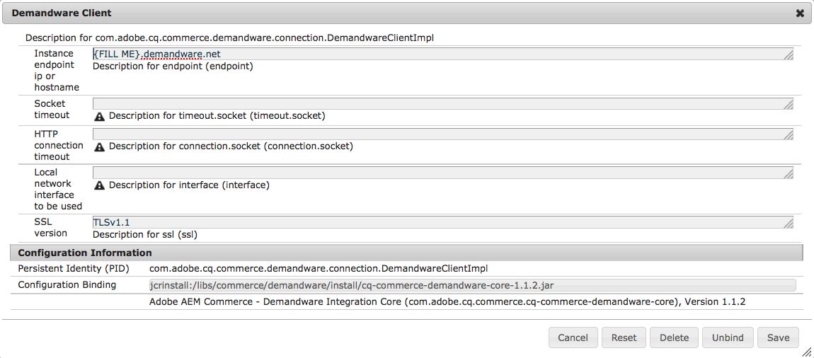

# Salesforce Commerce Cloud{#salesforce-commerce-cloud}

Deploying the necessary eCommerce packages will provide the full functionality of the eCommerce framework, together with a reference implementation of eCommerce functionality as provided with a Salesforce Commerce Cloud / Demandware implementation (including a demonstration catalog).

### Packages Needed for eCommerce with Salesforce Commerce Cloud {#packages-needed-for-ecommerce-with-salesforce-commerce-cloud}

To install eCommerce functionality you need:

* AEM eCommerce framework:

    * this is part of a standard AEM installation

* AEM Demandware Commerce content package

    * cq-6.4.0-featurepack-10262

>[!NOTE]
>
>This integration supports Salesforce Commerce Cloud / Demandware instances configured to use OCAPI version 17.6 or later.

### Installation of eCommerce with Salesforce Commerce Cloud {#installation-of-ecommerce-with-salesforce-commerce-cloud}

To install AEM with a Demandware Commerce integration configuration (using the demonstration catalog, Geometrixx Outdoors), the basic steps are:

1. [Install AEM](../../../sites/deploying/using/deploy.md).
1. Install the content package using the [package manager](../../../sites/administering/using/package-manager.md):
1. [Author](../../../sites/authoring/using/page-authoring.md) any supplementary pages that you need in AEM.

>[!NOTE]
>
>To download the packages, navigate to [Package Share](../../../sites/administering/using/package-manager.md#package-share).

The server connection between AEM and the Demandware Sandbox needs to be configured. Most of the configuration is already preconfigured to work with the provided SiteGenisis demo content package using default paths, libraries, and so on. If the connector is used with other sites and libraries, you will need to update this configuration.

1. Navigate to [http://localhost:4502/system/console/configMgr](http://localhost:4502/system/console/configMgr).
1. Click **Demandware Client**.
1. Enter the **Instance endpoint ip or hostname** as required.

   

1. Click **Save**.
1. Click **Demandware TransportHandler Plugin for WebDAV**.
1. Set the **WebDAV user** and the **WebDAV user password**.

   

1. Click **Save**.

#### Replication {#replication}

The replication should be enabled after the package installation, you can verify that here: [http://localhost:4502/etc/replication/agents.author/demandware.html](http://localhost:4502/etc/replication/agents.author/demandware.html)

>[!NOTE]
>
>The replication agent is configured to info log level by default. If you want to have more information, you can switch the log level to debug.

#### OAuth {#oauth}

The OAuth client is configured to work with a Demandware sandbox instance. For testing purposes, no change is needed.

For staging and productions systems, the OAuth clients need to be configured with appropriate client ID and password.

1. Navigate to [http://localhost:4502/system/console/configMgr](http://localhost:4502/system/console/configMgr).
1. Click **Demandware Access Token provider**.

   

1. Modify the values as required and click **Save**.

### Salesforce Commerce Cloud Sandbox {#salesforce-commerce-cloud-sandbox}

The Demandware Sandbox must be configured to run the new Velocity template engine.

>[!NOTE]
>
>The following wizard is not part of the AEM Demandware connector. It is provided as is as part of the demo content package to help with quickly setting up the SiteGenesis demo pages.

1. Navigate to [http://localhost:4502/etc/demandware/init.html](http://localhost:4502/etc/demandware/init.html).
1. Click **Edit.**
1. Verify the values and click **OK**.
1. Click **Initialize**.
1. Go to the WebDAV folder and check for published template files, for example under `adobe01-tech-prtnr-na01-dw.demandware.net/on/demandware.servlet/webdav/Sites/Dynamic/SiteGenesis`.

   >[!NOTE]
   >
   >The extension will be `.vs`.

1. Check also for exported JS and CSS files, for example under `adobe01-tech-prtnr-na01-dw.demandware.net/on/demandware.servlet/webdav/Sites/Libraries/SiteGenesisSharedLibrary`.

