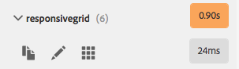
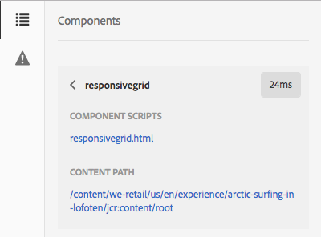
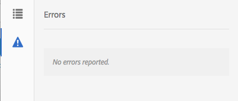

# Developer Mode{#developer-mode}

<!--
Comment Type: remark
Last Modified By: Alison Heimoz (aheimoz)
Last Modified Date: 2018-01-18T11:19:17.324-0500

might move

link to  http://author.day.com/content/docs/en/aem/6-2/develop/components/hobbes.html  http://author.day.com/content/docs/en/aem/6-2/develop/components/components-develop.html

-->

When editing pages in AEM, several [modes](../../../sites/authoring/using/author-environment-tools.md#modestouchoptimizedui) are available, including Developer mode. This opens a side panel with several tabs that provide a developer with infomation about the current page. The three tabs are:

* ** [Components](#components)** for viewing sructure and performance information.
* ** [Tests](#tests)** for running tests and analyzing the results.
* ** [Errors](#errors)** to see any problems occuring.

These help a developer to:

* Discover: what pages are composed of.
* Debug: what is happening where and when, which in turn helps to resolve issues.
* Test: does the application behave as expected.

<!--
Comment Type: remark
Last Modified By: Alison Heimoz (aheimoz)
Last Modified Date: 2018-01-18T11:19:17.407-0500

please confirm required permissions/privileges.

-->

>[!CAUTION]
>
>Developer mode:
>
>* Is only available in the touch-enabled UI (when editing pages).
>* Is not available on mobile devices or small windows on desktop (due to space restrictions).  
>
>    * This occurs when the width is less than 1024px.  
>
>* Requires the appropriate permissions/privileges:  
>
>    * Access to Developer Mode is given to users who have write access on `/apps`.
>

<!--
Comment Type: remark
Last Modified By: Alison Heimoz (aheimoz)
Last Modified Date: 2018-01-18T11:19:17.490-0500

what exactly needs documenting for <a href="https://jira.corp.adobe.com/browse/DOC-5442">https://jira.corp.adobe.com/browse/DOC-5442</a> on this page?

would the following with a link to the full documentation be sufficient (when it's written)?

 

-->

>[!CAUTION]
>
>Developer mode is only available on a standard author instance that is not using the nosamplecontent run-mode.
>
>If required it can be configured for use:
>
>* on an author instance using nosamplecontent run-mode   
>* a publish instance
>
>It should be disabled again after use.

<!--
Comment Type: remark
Last Modified By: Alison Heimoz (aheimoz)
Last Modified Date: 2018-01-18T11:19:17.571-0500

is the Gems session still appropriate?

-->

>[!NOTE]
>
>See the:
>
>* Knowledge Base article, [Troubleshooting AEM TouchUI issues](https://helpx.adobe.com/experience-manager/kb/troubleshooting-aem-touchui-issues.html), for further tips and tools.
>* AEM Gems session about [AEM 6.0 Developer Mode](http://docs.adobe.com/content/ddc/en/gems/aem-6-0-developer-mode.html).
>

### Opening Developer Mode {#opening-developer-mode}

Developer mode is implemented as a side panel to the page editor. To open the panel, select **Developer** from the mode selector in the toolbar of the page editor:

The panel is divided into two tabs:

* ** [Components](../../../sites/developing/using/developer-mode.md#components)** - This shows a component tree, similar to the [content tree](../../../sites/authoring/using/author-environment-tools.md#content-tree) for authors

* ** [Errors](../../../sites/developing/using/developer-mode.md#errors)** - When problems occur, details are shown for each component.

### Components {#components}

<!--
Comment Type: remark
Last Modified By: Alison Heimoz (aheimoz)
Last Modified Date: 2018-01-18T11:19:17.774-0500

is there more - enough to justify its own page?

-->

<!--
Comment Type: remark
Last Modified By: Alison Heimoz (aheimoz)
Last Modified Date: 2018-01-18T11:19:17.800-0500

what are the possible colours for the timings (eg orange, yellow, ???)? and their significance?

is the following true? what about orange/yellow?

"Timers:

<ul>
<li>The component render times that are excessively slow should be displayed in red.</li>
<li>Excessively slow means that it takes 3x longer than the average to render (always consider the time of the component itself, basically substracting the time sub-components took to render).</li>
<li>Parent components of slow components should display some hint that they have a slow child.</li>
<li>If the page takes more that 100ms to render, it's time should be displayed in big fat blinking shaking phosphorescent red.</li>
</ul>

"

-->

 

<!--
Comment Type: remark
Last Modified By: Alison Heimoz (aheimoz)
Last Modified Date: 2018-01-18T11:19:17.860-0500

what the difference between links provided by View Details and the one provided via Edit Script (this component one appears in the both).....just quicker access?  

-->

This shows a component tree that:

* Outlines the chain of components and templates rendered on the page (SLY, JSP, etc.). The tree can be expanded to show context within the hierarchy.  
* Shows the server-side computational time needed to render the component.
* Allows you to expand the tree and select specific components within the tree. Selection provides access to component details; such as:

    * Repository path
    * Links to scripts (accessed in CRXDE Lite)

* Selected components (in the content flow, indicated by a blue border) will be highlighted in the content tree (and vice versa).

This can help to:

* Determine and compare the rendering time per component.
* See and understand the hierarchy.  
* Understand, and then improve, the page loading time by finding slow components.

Each component entry can show (for example):

* **View Details**: a link to a list that shows:

    * all component scripts used to render the component.
    * the repository content path for this specific component.

  

* **Edit Script**: a link that:

    * opens the component script in CRXDE Lite.

* Expanding a component entry (arrow head) can also show:

    * The hierarchy within the selected component.
    * Rendering times for the selected component in isolation, any individual components nested within it, and the combined total.

  

>[!CAUTION]
>
>Some links point to scripts under `/libs`. However, these are for reference only, you **must not** edit anything under `/libs`, as any changes you do make may be lost. This is due to the fact that this branch is liable to changes whenever you upgrade or apply a hotfix/feature pack. Any changes you require should be made under `/apps`, see [Overlays and Overrides](/sites/developing/using/overlays.md).

### Errors {#errors}

Hopefully the **Errors** tab will always be empty (as above), but when problems occur the following details are shown for each component:

* A warning if the component writes an entry to the error log, together with details of the error and direct links to the appropriate code within CRXDE Lite.  
* A warning if the component opens an admin session.

<!--
Comment Type: remark
Last Modified By: Alison Heimoz (aheimoz)
Last Modified Date: 2018-01-18T11:19:18.390-0500

these are from the 6.0 Gems session - any better examples from 6.1 ? how to reproduce an error (example used in gems doesn't seem to work any more - better error handling? :)  

-->

For example, in a situation where a undefined method is called, the resulting error will be shown in the **Errors** tab:

The component entry in the tree of the Components tab will also be marked with an indicator when an error occurs.

### Tests {#tests}

>[!CAUTION]
>
>In AEM 6.2, the testing features of Developer mode was re-implemented as a standalone Tools application.
>
>For full details see [Testing Your UI](../../../sites/developing/using/hobbes.md).

