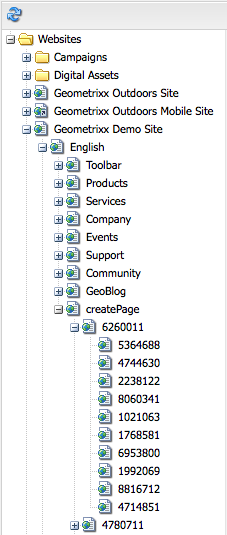
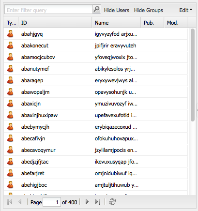
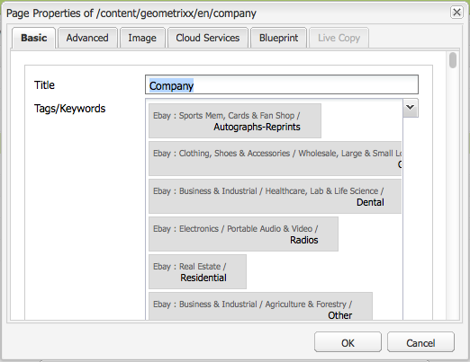
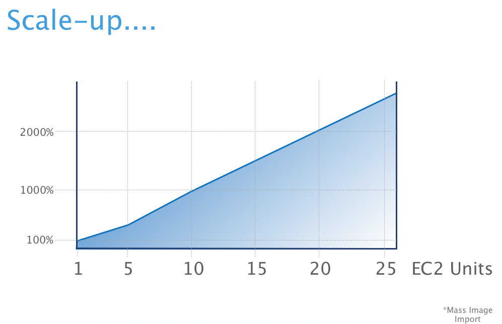

# Tough Day{#tough-day}

## What is Tough Day 2 {#what-is-tough-day}

"Tough Day 2" is a an application that allows you to stress test the limits of your AEM instance. It can be run out of the box with the default test suite or it can be configured to fit your testing needs. You can watch [this recording](https://docs.adobe.com/ddc/en/gems/Toughday2---A-new-and-improved-stress-testing-and-benchmarking-tool.html) for a presentation of the application.

## How to run Tough Day 2 {#how-to-run-tough-day}

Download the latest version of Tough Day 2 from the [Adobe Repository](https://repo.adobe.com/nexus/content/repositories/releases/com/adobe/qe/toughday2/). After you download the application, you can run it out of the box by providing the `host` parameter. In the following example, the AEM instance runs locally so the `localhost` value is used:

```xml
java -jar toughday2.jar --host=localhost
```

The default suite that runs after adding the parameters is named `toughday`. It contains the following use cases:

* Create pages and live copies for them (including rollouts)
* Get Homepage
* Run queries in querybuilder
* Create asset hierarchies
* Delete assets

The suite contains 15% write actions and 85% read actions.

To run the suite tests, Tough Day 2 will install its default content package. This can be avoided by setting the `installsamplecontent`parameter to `false`, but remember that you should also change the default paths for the tests that you intend to run. If the jar is run without parameters, Tough Day 2 displays the [help information](../../../sites/developing/using/tough-day.md#getting-help).

As a general rule, you can use the application by following this pattern:

```xml
java -jar toughday2.jar [--help | --help_full | --help_tests | --help_publish]  [<global arguments> | <actions> | --runmode | --publishmode]
```

>[!NOTE]
>
>Tough Day 2 does not have a clean up step. As a result, it is recommended to run Tough Day 2 on a cloned staging instance and not on the main production instance. The staging instance should be dropped after the tests.
>

### Getting Help {#getting-help}

Tough Day 2 offers a wide range of help options that can be accessed from the command line. For example:

```xml
java -jar toughday2.jar --help_full
```

In the table below, you can find the relevant help parameters.

<table border="1" cellpadding="1" cellspacing="0" width="100%"> 
 <tbody> 
  <tr> 
   <td><strong>Parameter</strong></td> 
   <td><strong>Description</strong></td> 
   <td><strong>Example</strong></td> 
  </tr> 
  <tr> 
   <td>--help</td> 
   <td>Prints out global information, for example: the available actions, predefined suites, run modes and global parameters.</td> 
   <td> </td> 
  </tr> 
  <tr> 
   <td>--help_publish</td> 
   <td>Prints out all the available publishers.</td> 
   <td> </td> 
  </tr> 
  <tr> 
   <td>--help_tests</td> 
   <td>Prints the test classes and their description.</td> 
   <td> </td> 
  </tr> 
  <tr> 
   <td>--help_full</td> 
   <td>Prints all of the above, plus tests, publishers and suite components.</td> 
   <td> </td> 
  </tr> 
  <tr> 
   <td> --help --runmode/publishmode type=&lt;Mode&gt;</td> 
   <td>Lists information about the specified run or publish mode.</td> 
   <td><p>java -jar toughday2.jar --help --runmode type=constantload</p> <p>java -jar toughday2.jar --help --publishmode type=intervals</p> </td> 
  </tr> 
  <tr> 
   <td>--help --suite=&lt;SuiteName&gt;</td> 
   <td>Lists all the tests of a given suite and their respective configurable properties.</td> 
   <td><br /> java -jar toughday2.jar --help --suite=get_tests</td> 
  </tr> 
  <tr> 
   <td> --help --tag=&lt;Tag&gt;</td> 
   <td><br /> Lists all the items that have the specified tag.</td> 
   <td>java -jar toughday2.jar --help --tag=publish</td> 
  </tr> 
  <tr> 
   <td>--help &lt;TestClass/PublisherClass&gt;</td> 
   <td><br /> Lists all the configurable properties for the given test or publisher.</td> 
   <td><p>java -jar toughday2.jar --help UploadPDFTest</p> <p>java -jar toughday2.jar --help CSVPublisher</p> </td> 
  </tr> 
 </tbody> 
</table>

### Global Parameters {#global-parameters}

Tough Day 2 offers global parameters that set or change the environment for the tests. These include the host that is targeted, the port number, the protocol used, user and password for the instance and many more. For example:

```xml
java -jar toughday2.jar --host=host --protocol=https --port=4502 --duration=30m --dryrun=true 
```

You can find the relevant parameters in the list bellow:

| **Parameter** |**Description** |**Default Value** |**Possible Values** |
|---|---|---|---|
| --installsamplecontent=<Val> |Either installs or skips the default Tough Day 2 content package. |true |true or false |
| --protocol=<Val> |The protocol used for the host. |http |http or https |
| --host=<Val> |The host name or IP that will be targeted. |  |  |
| --port=<Val> |The port of the host. |4502 |  |
| --user=<Val> |The user name for the instance. |admin |  |
| --password=<Val> |Password for the given user. |admin |  |
| --duration=<Val> |The duration of the tests. Can be expressed in (**s**)econds, (**m**)inutes, (**h**)ours and (**d**)ays. |1d |  |
| --timeout=<Val> |How long a test will run before it will be interrupted and marked as failed. Expressed in seconds. |180 |  |
| --suite=<Val> |The value can be one or a list (separated by commas) of predefined test suites. |toughday |  |
| --configfile=<Val> |The targeted yaml configuration file. |  |  |
| --contextpath=<Val> |Instance's context path. |  |  |
| --loglevel=<Val> |The log level for the Tough Day 2 engine. |INFO |ALL, DEBUG, INFO, WARN, ERROR, FATAL, OFF |
| --dryrun=<Val> |If true, prints the resulting configuration and does not run any tests. |false |true or false |

## Customizing {#customizing}

Customization can be achieved in two ways: command line parameters or yaml configuration files. **Configuration files are generally used for large custom suites and they will override the Tough Day 2 default parameters. Command line parameters override both configuration files and the default parameters.**

The only way to save a test configuration is to copy it in yaml format. For additional details, see this [toughday.yaml](https://repo.adobe.com/nexus/service/local/repositories/releases/content/com/adobe/qe/toughday2/0.2.1/toughday2-0.2.1.yaml) configuration and the yaml configuration examples in the sections below.

### Adding a New Test {#adding-a-new-test}

If you do not want to use the default `toughday` suite you can add a test of your choosing by using the `add` parameter. The examples below show how to add the `CreateAssetTreeTest` test either by using command line parameters or a yaml configuration file.

By using command line parameters:

```xml
java -jar toughday2.jar --host=localhost --add CreateAssetTreeTest
```

By using a yaml configuration file:

```xml
globals:
  host : localhost
tests:
  - add : CreateAssetTreeTest
```

### Adding Multiple Instances of the Same Test  {#adding-multiple-instances-of-the-same-test}

You can also add and run multiple instances of the same test, but each instance must have an unique name. The examples below show how to add two instances of the same test either by using command line parameters or a yaml configuration file.

By using command line parameters:

```xml
java -jar toughday2.jar --host=localhost --add CreateAssetTreeTest name=FirstAssetTree --add CreateAssetTreeTest name=SecondAssetTree
```

By using a yaml configuration file:

```xml
globals:
  host : localhost
tests:
  - add : CreateAssetTreeTest
    properties:
      name : FirstAssetTree
  - add : CreateAssetTreeTest
    properties:
      name : SecondAssetTree
```

### Changing the Test Properties {#changing-the-test-properties}

In case you need to change one or more of the test properties, you can add that property to the command line or the yaml configuration file. To see all the available test properties add the `--help <TestClass/PublisherClass>` parameter to the command line, for example:

```xml
java -jar toughday2.jar --help CreatePageTreeTest
```

Please keep in mind that yaml configuration files will overwrite the Tough Day 2 default parameters and command line parameters will override both the configuration files and the defaults.

The examples below show how to change the `template` property for the `CreatePageTreeTest` test either by using either command line parameters or a yaml configuration file.

By using command line parameters:

```xml
java -jar toughday2.jar --host=localhost --add CreatePageTreeTest template=/conf/toughday-templates/settings/wcm/templates/toughday-template
```

By using a yaml configuration file:

```xml
globals:
  host : localhost
tests:
  - add : CreatePageTreeTest
    properties:
      template : /conf/toughday-templates/settings/wcm/templates/toughday-template
```

### Working with Predefined Test Suites {#working-with-predefined-test-suites}

The examples below show how to add a test to a predifined suite and how to reconfigure and exclude an existing test from a predefined suite.

You can add a new test to a predefined suite using the `add` parameter and specifying the targeted predefined suite.

By using command line parameters:

```xml
java -jar toughday2.jar --host=localhost --suite=toughday --add CreatePageTreeTest
```

By using a yaml configuration file:

```xml
globals:
  host : localhost
  suite : toughday
tests:
  - add : CreatePageTreeTest
```

Existing tests in a given suite can also be reconfigured using the `config`* *parameter. Please note that you must also specify the suite name and the actual name of the test (not the Test Class name). You can find the test name in the `name` property of the Test Class. For further details on how to find test properties, read the [Changing Test Properties](../../../sites/developing/using/tough-day.md#changing-the-test-properties) section.

In the example below the default asset title for the `CreatePageTreeTest` (named `UploadAsset`) is changed to "NewAsset".

By using command line parameters:

```xml
java -jar toughday2.jar --host=localhost --suite=toughday --config UploadAsset title=NewAsset
```

By using a yaml configuration file:

```xml
globals:
  host : localhost
  suite : toughday
tests:
  - config : UploadAsset
    properties :
      title : NewAsset 
```

Aditionally, you can also remove tests from predefined suites or publishers from the default configuration with the use of the `exclude` parameter. Please note that you must also specify the suite name and the actual name of the test (not the Test C `lass` name). You can find the test name in the `name` property of the test class. In the example below, the `CreatePageTreeTest` (named `UploadAsset`) test is removed from the toughday suite.

By using command line parameters:

```xml
java -jar toughday2.jar --host=localhost --suite=toughday --exclude UploadAsset
```

By using a yaml configuration file:

```xml
globals:
  host : localhost
  suite : toughday
tests:
  - exclude : UploadAsset 
```

### Run Modes {#run-modes}

Tough Day 2 can run in one of the following modes: **normal** and **constant load**.

The **normal** run mode has two parameters:

* `concurrency`** **- concurrency represents the number of threads that Tough Day 2 will create for test execution. On these threads, tests will be executed until either the duration has run out or there are no more tests to execute.

* `waittime` - the wait time between two consecutive test executions on the same thread. The value must be expressed in milliseconds.

The example below shows how to add the parameters by using either the command line:

```xml
java -jar toughday2.jar --host=localhost --add CreateAssetTreeTest --runmode=normal concurrency=20
```

or by using a yaml configuration file:

```xml
runmode:
  type : normal
  waittime : 300
  concurrency : 200
```

The **constant load** run mode differs from the normal run mode by generating a constant number of started test executions, rather than a constant number of threads. You can set the load by using the run mode parameter with the same name.

### Test Selection {#test-selection}

The test selection process is the same for both run modes and it goes as follows: all tests have a `weight` property, which determines the likelihood of execution in a thread. For example, if we have two tests, one with a weight of 5 and the other with a weight of 10, the latter is two times more likely to be executed than the former.

Furthermore, tests can have a `count` property, which limits the number of executions to a given number. After this number is passed, no further executions of the test will occur. All test instances that are already running will finish the run as configured. The following example shows how to add these parameters either at the command line or by using a yaml configuration file.

```xml
java -jar toughday2.jar --host=localhost --add CreateAssetTreeTest weight=5 --add CreatePageTreeTest weight=10 count=100 --runmode=normal concurrency=20 
```

or

```xml
- add : CreateAssetTreeTest
    properties :
      name : UploadAsset
      weight : 5
      base : 3
      foldertitle : IAmAFolder
      assettitle : IAmAnAsset
      count : 100

```

>[!NOTE]
>
>Due to parallel executions, the actual number of test runs will not be exactly the amount configured in the `count` parameter. Expect a deviation proportional to the number of running threads (controlled by the `concurrency parameter`).

### Dry Run {#dry-run}

A dry run parses all the given input (command line parameters or config files), merging it with the defaults and then outputs the results. It does not execute any of the tests.

```xml
java -jar toughday2.jar --host=localhost --suite=toughday --add CreatePageTreeTest --dryrun=true
```

## Output {#output}

Tough Day 2 outputs both test metrics and logs. For further details, read the following sections.

### Test Metrics {#test-metrics}

Tough Day 2 currently reports 9 test metrics that you can evaluate. Metrics with the **&#42;** symbol are reported only after successful runs:

| **Name** |**Description** |
|---|---|
| Timestamp |Timestamp of the last finished test run. |
| Passed |Number of successful runs. |
| Failed |Number of failed runs. |
| Min&#42; |Lowest duration of test execution. |
| Max&#42; |Highest duration of test execution. |
| Median&#42; |Computed median duration of all test executions. |
| Average&#42; |Computed average duration of all test executions. |
| StdDev&#42; |The standard deviation. |
| 90p&#42; |90 percentile. |
| 99p&#42; |99 percentile. |
| 99.9p&#42; |99.9 percentile. |
| Real Throughput &#42; |Number of runs divided by the elapsed execution time. |

These metrics are written with the help of publishers** **that can be added with the `add` parameter (similarly to adding tests). Currently, there are two options:

* **CSVPublisher** - the output is a CSV file.
* **ConsolePublisher** - the output is displayed in the console.

By default, both publishers are enabled.

Additionally, there are two modes in which the metrics are reported:

* The **simple** publish mode - reports the results from the beginning of the execution up to the point of publishing. 
* The **intervals** publish mode - reports the results in a given time frame. You can set the time frame with the **interval** publish mode parameter.

The following example shows how to configure the `intervals` parameter either at the command line or by using a yaml configuration file.

By using command line parameters:

```xml
java -jar toughday2.jar --host=localhost --add CreatePageTreeTest --publishmode type=intervals interval=10s 
```

By using a yaml configuration file:

```xml
publishmode:
     type : intervals 
     interval : 10s 
     tests: 
        -add : CreatePageTreeTest

```

### Logging {#logging}

Tough Day 2 creates a logs folder in the same directory where you ran Tough Day 2. This folder contains two types of logs:

* **toughday.log**: contains messages related to the application state, debugging information and global messages.
* **toughday_&lt;testname&gt;.log**: messages related to the specified test.

The logs are not overwritten, subsequent runs will append messages to the existing logs. The logs have several levels, for more information see the ` [loglevel parameter](../../../sites/developing/using/tough-day.md#global-parameters)`.

<!--
Comment Type: draft

<h2>What is the “Tough Day” test?</h2>
-->

<!--
Comment Type: draft

<p>The default “Tough Day” test simulates the daily load of around 1000 authors in a worst-case scenario with all the operations going on at the same time. To make things worse the test deviates from best practices using very unfortunate, not recommended content structures.</p>
-->

<!--
Comment Type: draft

<note type="note">
<p>For information about maximizing response times, see <a href="/sites/deploying/using/configuring-performance.md">Performance Optimization</a>.</p>
<p> </p>
</note>
-->

<!--
Comment Type: draft

<h2>Use cases</h2>
-->

<!--
Comment Type: draft

<p>Tough Day has mainly two usecases:</p>
<ul>
<li>Stress testing the system with a much larger number of users in parallel than can normally occur</li>
<li>Simulate a certain number of users in parallel that is close to the number of peak users an author installation can have. This is the more used test.</li>
</ul>
-->

<!--
Comment Type: draft

<note type="caution">
<p>Please note that for the second use-case, the <strong><span class="code">createPages.thinkt</span></strong> parameter needs to be specified. Example:</p>
<p><span class="code">java -Xmx1024m -Dhostname=localhost -Dport=4502 -DcreatePages.toplevels=2 -DcreatePages.sublevels=2 -DcreatePages.subsublevels=2 -DcreatePages.concurrentUsers=3 -DcreatePages.rampup=1 -DcreatePages.thinkt=5 -DcreatePages.activate=true -DcreatePages.delete=true -jar toughday.jar createPages </span></p>
</note>
-->

<!--
Comment Type: draft

<note type="note">
<p>For estimating the number of users on an author instance, you can use the <a href="/sites/developing/using/analyze-request.md">Request Analysis Script</a></p>
<p> </p>
</note>
-->

<!--
Comment Type: draft

<h2>Outline</h2>
-->

<!--
Comment Type: draft

<p>A cron job triggers a bash script which downloads the current nightly build. The nightly build is uploaded with the S3CMD tools into an Amazon S3 bucket inside the cloud. Multiple EC2 machines with different configurations and hardware specifications are instantiated from existing AMIs. Each machine starts an ANT script which installs and configures the nightly build of CQ and starts all configured tests parallel. After the tests have passed or failed the results are gathered and send back to the Day QaBase. The virtual machines are terminated 48 hours later.</p>
-->

<!--
Comment Type: draft

<h2>Sub tests</h2>
-->

<!--
Comment Type: draft

<h3>Create pages</h3>
-->

<!--
Comment Type: draft

<p>Creates content pages inside CQ, adds different components to the page, activates the page and deletes the page. This test is executed with 30 concurrent users and zero think time. The test creates a three level site hierarchy.</p>
-->

<!--
Comment Type: draft


-->

<!--
Comment Type: draft

<h3>Upload image</h3>
-->

<!--
Comment Type: draft

<p>Imports images into CQ DAM. Uses the ExifTool to modify and multiply one source image.</p>
-->

<!--
Comment Type: draft


-->

<!--
Comment Type: draft

<h3>MSM</h3>
-->

<!--
Comment Type: draft

<p>Performs many MSM page roll outs, by creating live copies of the Geometrixx Demo Site.</p>
-->

<!--
Comment Type: draft


-->

<!--
Comment Type: draft

<h3>Import User</h3>
-->

<!--
Comment Type: draft

<p>Imports user into CQ with random IDs and Names.</p>
-->

<!--
Comment Type: draft


-->

<!--
Comment Type: draft

<h3>Tags</h3>
-->

<!--
Comment Type: draft

<p>Creates a large taxonomy tree inside CQ with 21050 tags.</p>
-->

<!--
Comment Type: draft


-->

<!--
Comment Type: draft

<h3>Assign Tags</h3>
-->

<!--
Comment Type: draft

<p>Assigns 1000 tags to each Geometrixx Demo page.</p>
-->

<!--
Comment Type: draft


-->

<!--
Comment Type: draft

<h2>Tough Day advantages</h2>
-->

<!--
Comment Type: draft

<ul>
<li>Hardware independent</li>
<li>Persistence Manager independent</li>
<li>Cluster independent</li>
<li>allows to create height load</li>
<li>allows to create large amount of content</li>
<li>allows to test with many concurrent users</li>
<li>allows to test different kind of content structures</li>
<li>allows to test different kind of CQ operations at the same time</li>
<li>allows to measure infrastructure performance</li>
</ul>
-->

<!--
Comment Type: draft

<h2>Cloud ready</h2>
-->

<!--
Comment Type: draft

<p>The test was designed to use the cloud for the test execution. The cloud offers the possibility to run the same test on different hardware, OS, java versions and on 32 or 64 bit architecture.</p>
-->

<!--
Comment Type: draft

<h2>Cluster ready</h2>
-->

<!--
Comment Type: draft

<p>Can also be used to test the cluster. Configure the hostname of the master or a slave node to run the test against this node. The master and one or more slave nodes can also be tested simultaneously.</p>
-->

<!--
Comment Type: draft

<h2>Cluster & Cloud</h2>
-->

<!--
Comment Type: draft

<p>Testing the cluster functionality inside the Cloud allows you to switch between one machine, multiple machines in the same zone and same region, different zones but same region and different regions.</p>
-->

<!--
Comment Type: draft


-->

<!--
Comment Type: draft

<h2>What does the “Tough Day” test do</h2>
-->

<!--
Comment Type: draft

<p>The number of pages, users, images etc. that will be created can be configured. Following is the default for our nightly build tests:</p>
-->

<!--
Comment Type: draft


-->

<!--
Comment Type: draft

<note type="note">
<p>"These are all “write tests," simulating Individual CQ5 end-user browser Operations and cannot be compared to bare-bone repository operations. Tests performed: running Windows 2008 Server”.</p>
</note>
-->

<!--
Comment Type: draft

<h3>10x Tough Day</h3>
-->

<!--
Comment Type: draft

<p>Once every load, we execute a test that runs ten times longer than our default test.</p>
-->

<!--
Comment Type: draft


-->

<!--
Comment Type: draft

<h2>Benchmarking</h2>
-->

<!--
Comment Type: draft

<p>The following results are from a test on a medium amazon machine.</p>
<ul>
<li>Create 1000 pages with 5000 page updates: 225 seconds</li>
<li>Import 50 Images: 79 seconds</li>
<li>Create 2000 users: 101 seconds</li>
</ul>
-->

<!--
Comment Type: draft


-->

<!--
Comment Type: draft

<h3>Hardware</h3>
-->

<!--
Comment Type: draft

<h4>Amazon EC2 m1.large</h4>
-->

<!--
Comment Type: draft

<table border="1" cellpadding="1" cellspacing="0" width="100%">
<tbody>
<tr>
<td>7.5 GB memory</td>
</tr>
<tr>
<td>4 EC2 Compute Units (2 virtual cores with 2 EC2 Compute Units each)</td>
</tr>
<tr>
<td>850 GB instance storage</td>
</tr>
<tr>
<td>64-bit platform</td>
</tr>
<tr>
<td>I/O Performance: High</td>
</tr>
<tr>
<td>API name: m1.large</td>
</tr>
</tbody>
</table>
-->

<!--
Comment Type: draft

<h3>OS</h3>
-->

<!--
Comment Type: draft

<table border="1" cellpadding="1" cellspacing="0" width="100%">
<tbody>
<tr>
<td>Windows Server 2008 DataCenter 64 Bit</td>
</tr>
</tbody>
</table>
-->

<!--
Comment Type: draft

<h2>Scalability</h2>
-->

<!--
Comment Type: draft


-->

<!--
Comment Type: draft

<p>Increasing the CPU power by 26 times increases the throughput by 11 times and with very fast I/0 even by 24 times.</p>
-->

<!--
Comment Type: draft

<h2>Tools Used</h2>
-->

<!--
Comment Type: draft

<h3>Jmeter</h3>
-->

<!--
Comment Type: draft

<p>Used for the create page and MSM test.</p>
-->

<!--
Comment Type: draft

<h3>ExifTool</h3>
-->

<!--
Comment Type: draft

<p>Used for the upload image test.</p>
-->

<!--
Comment Type: draft

<h3>Ant</h3>
-->

<!--
Comment Type: draft

<p>Used as test runner for all tests.</p>
-->

<!--
Comment Type: draft

<h3>EC2 Tools</h3>
-->

<!--
Comment Type: draft

<p>Used for starting and stopping virtual machines in the cloud.</p>
-->

<!--
Comment Type: draft

<h3>S3CMD</h3>
-->

<!--
Comment Type: draft

<p>Used for uploading and downloading binaries into the cloud.</p>
-->

<!--
Comment Type: draft

<h3>CURL</h3>
-->

<!--
Comment Type: draft

<p>Used for the upload image, tags and create user test.</p>
-->

<!--
Comment Type: draft

<h3>Bash</h3>
-->

<!--
Comment Type: draft

<p>Used for the upload image, tags and create user test.</p>
-->

<!--
Comment Type: draft

<h2>Customer Tough Day Tool</h2>
-->

<!--
Comment Type: draft

<p><span class="code">Toughday-5.6.1.jar</span> is a command line tool to quickly stress test your system. It is a derivative of the Tough Day test. It allows you to create pages, users, tags and images on a CQ instance. You can measure your server performance with a benchmark.</p>
-->

#### Example Usage {#example-usage}

<!--
Comment Type: draft

<codeblock gutter="true" class="syntax shell">
java&nbsp;-Xmx1024m&nbsp;-Dhostname=localhost&nbsp;-Dport=4502&nbsp;-DuploadImage.count=10&nbsp;-jar&nbsp;toughday-5.6.1.jar&nbsp;uploadImage
</codeblock>
-->

<!--
Comment Type: draft

<p>This would unpack the jar into a <span class="code">toughday</span> folder in the current directory. After that it starts an <span class="code">uploadImage</span> test with 10 images to a CQ instance which is running on <span class="code">localhost:4502</span>.</p>
<p>The tool supports CQ 5.6.1</p>
<p>Important folder and files:</p>
<ul>
<li><span class="code">toughday.properties</span><br /> Contains the default values for the tests</li>
<li><span class="code">tasks</span><br /> Contains the tests, each test contains his own folder</li>
<li><span class="code">task/build.fragment</span><br /> Which is an ant fragment file which contains at least one ant target with the name of the test e.g. "createPages" and must be depending on the "test" target.</li>
</ul>
-->

#### Known Issues {#known-issues}

<!--
Comment Type: draft

<codeblock gutter="true" class="syntax shell">
java&nbsp;-Xmx1024m&nbsp;-Dhostname=localhost&nbsp;-Dport=4502&nbsp;-jar&nbsp;toughday-5.6.1.jar&nbsp;all
</codeblock>
-->

<!--
Comment Type: draft

<p>This runs all tests in parallel. The <span class="code">addTagsToGeometrixxPages</span> test depends on the tags test so it might fail because of the timing.</p>
-->

<!--
Comment Type: draft

<h3>Download</h3>
-->

<!--
Comment Type: draft

<p>The current version of the jar file can be downloaded here:<br /> </p>
-->

[Get File](assets/toughday-6_1.jar)

<!--
Comment Type: draft

<note type="note">
<p>This JAR file was updated for AEM 6.1 due to the CRSF protection feature. Using the earlier version of this JAR file will result in the following errors:</p>
<p>"<i>com.adobe.granite.csrf.impl.CSRFFilter isValidRequest: empty CSRF token - rejecting</i>"</p>
<p>"<i>com.adobe.granite.csrf.impl.CSRFFilter doFilter: the provided CSRF token is invalid</i>"</p>
</note>
-->

<!--
Comment Type: draft

<h3>Tests</h3>
-->

<!--
Comment Type: draft

<h3>create Pages</h3>
-->

<!--
Comment Type: draft

<p>Create a bunch of geometrixx pages in the repository.</p>
-->

#### Example Usage {#example-usage-1}

<!--
Comment Type: draft

<codeblock gutter="true" class="syntax shell">
java&nbsp;-Xmx1024m&nbsp;-Dhostname=localhost&nbsp;-Dport=4502&nbsp;-DcreatePages.toplevels=2&nbsp;-DcreatePages.sublevels=2&nbsp;-DcreatePages.subsublevels=2&nbsp;-DcreatePages.concurrentUsers=3&nbsp;-DcreatePages.rampup=1&nbsp;-DcreatePages.thinkt=5&nbsp;-DcreatePages.activate=true&nbsp;-DcreatePages.delete=true&nbsp;-jar&nbsp;toughday-5.6.1.jar&nbsp;createPages
</codeblock>
-->

<!--
Comment Type: draft

<h3>create pages cluster</h3>
-->

<!--
Comment Type: draft

<p>Create a bunch of geometrixx pages in a clustered repository.<br /> </p>
-->

#### Example Usage {#example-usage-2}

<!--
Comment Type: draft

<codeblock gutter="true" class="syntax shell">
java&nbsp;-Xmx1024m&nbsp;-Dhostname=localhost&nbsp;-Dport=4502&nbsp;-Dhostname.slave=localhost&nbsp;-Dport.slave=8080&nbsp;-DcreatePagesCluster.concurrentUsers=10&nbsp;-DcreatePagesCluster.rampup=1&nbsp;-DcreatePagesCluster.loop=10&nbsp;-jar&nbsp;toughday-5.6.1.jar&nbsp;createPagesCluster
</codeblock>
-->

<!--
Comment Type: draft

<h3>MSM</h3>
-->

<!--
Comment Type: draft

<p>Test the MultiSiteManager (MSM) using geometrixx.</p>
-->

#### Example Usage {#example-usage-3}

<!--
Comment Type: draft

<codeblock gutter="true" class="syntax shell">
java&nbsp;-Xmx1024m&nbsp;-Dhostname=localhost&nbsp;-Dport=4502&nbsp;-DCQ5MSMNewSite.count=10&nbsp;-DCQ5MSMNewSite.testplan=CQ5MSMNewSite-1.0.jmx&nbsp;-jar&nbsp;toughday-5.6.1.jar&nbsp;CQ5MSMNewSite
</codeblock>
-->

<!--
Comment Type: draft

<h3>DAM</h3>
-->

<!--
Comment Type: draft

<p>Create a number of different images in the repository. This also triggers some DAM workflows<br /> (metadata extraction, renditions etc.).</p>
-->

#### Example Usage {#example-usage-4}

<!--
Comment Type: draft

<codeblock gutter="true" class="syntax shell">
java&nbsp;-Xmx1024m&nbsp;-Dhostname=localhost&nbsp;-Dport=4502&nbsp;-DuploadImage.count=10&nbsp;-jar&nbsp;toughday-5.6.1.jar&nbsp;uploadImage
</codeblock>
-->

<!--
Comment Type: draft

<h3>benchmark</h3>
-->

<!--
Comment Type: draft

<p>Execute the <span class="code">createPages</span> and <span class="code">uploadImages</span> tasks and measure the time they require to run. This enables you to compare the results with those of an Amazon m1-large instance.<br /> </p>
-->

#### Example Usage {#example-usage-5}

<!--
Comment Type: draft

<codeblock gutter="true" class="syntax shell">
java&nbsp;-Xmx1024m&nbsp;-Dhostname=localhost&nbsp;-Dport=4502&nbsp;-jar&nbsp;toughday-5.6.1.jar&nbsp;benchmark
</codeblock>
-->

<!--
Comment Type: draft

<h3>tagging</h3>
-->

<!--
Comment Type: draft

<p>Create ~20000 tags below <span class="code">/etc/tags/ebay</span>.<br /> </p>
-->

#### Example Usage {#example-usage-6}

<!--
Comment Type: draft

<codeblock gutter="true" class="syntax shell">
java&nbsp;-Xmx1024m&nbsp;-Dhostname=localhost&nbsp;-Dport=4502&nbsp;-jar&nbsp;toughday-5.6.1.jar&nbsp;tags
</codeblock>
-->

<!--
Comment Type: draft

<h3>tagging 2</h3>
-->

<!--
Comment Type: draft

<p>Add ~100000 tags to <span class="code">/content/geometrixx/en/jcr:content</span> (dependent on the Tags test).</p>
-->

#### Example Usage {#example-usage-7}

<!--
Comment Type: draft

<codeblock gutter="true" class="syntax shell">
java&nbsp;-Xmx1024m&nbsp;-Dhostname=localhost&nbsp;-Dport=4502&nbsp;-jar&nbsp;toughday-5.6.1.jar&nbsp;addTagsToGeometrixxPages
</codeblock>
-->

<!--
Comment Type: draft

<h3>upload PDF</h3>
-->

<!--
Comment Type: draft

<p>Uploads a number of PDFs. This also triggers certain DAM workflows (used for metadata extraction, etc.).</p>
-->

#### Example Usage {#example-usage-8}

<!--
Comment Type: draft

<codeblock gutter="true" class="syntax shell">
java&nbsp;-Xmx1024m&nbsp;-Dhostname=localhost&nbsp;-Dport=4502&nbsp;-DuploadPdf.count=10&nbsp;-jar&nbsp;toughday-5.6.1.jar&nbsp;uploadPdf
</codeblock>
-->

<!--
Comment Type: draft

<h3>Authoring Scenario</h3>
-->

<!--
Comment Type: draft

<p>From 5.5 onwards there are new author scenario tests which simulate all GET and POST requests (97% GET, 3% POST).<br /> <br /> To achieve this we have defined a scenario that simulates a regular use case for authors. This includes steps including creating a page, adding some components, rating some content, activating some pages and deleting pages.</p>
<p>The Authoring Scenario uses the Geometrixx Demo Site:</p>
<ol>
<li>Login into CQ (<span class="code">http://&lt;hostname&gt;:&lt;port&gt;</span>)</li>
<li>Open WebSites</li>
<li>Navigate to Geometrixx Demo Site --&gt; English</li>
<li>Create a new Page with a random title and the Geometrixx Content Page template</li>
<li>Open the testPage</li>
<li>Add a Sitemap component to the paragraph system</li>
<li>Add a Flash component to the paragraph system</li>
<li>Select the Movies tab inside the Content Finder</li>
<li>Drag & Drop the item triangles.swf to the Flash Component</li>
<li>Add a Text & Image component to the paragraph system</li>
<li>Select the Images tab inside the Content Finder</li>
<li>Scroll down and drag & drop the file geo_hq.jpg to the Image component</li>
<li>Edit the Text & Image component and write following text:<br /> "Our triangles meet all ISO and DIN industry standards, GeoMetrixx# gives you the ability to effortlessly offer the perfect product and support."</li>
<li>Add a Tag Cloud to the paragraph system</li>
<li>Edit the Tag Cloud, set Tags to Display to All tags</li>
<li>Add a Ratings component to the paragraph system</li>
<li>Add a Comments component to the paragraph system</li>
<li>Activate the Page with the depending assets inside the Siteadmin</li>
<li>Open the Page</li>
<li>Delete the Page inside the Siteadmin<br /> </li>
</ol>
-->

#### Example Usage {#example-usage-9}

<!--
Comment Type: draft

<codeblock gutter="true" class="syntax shell">
java&nbsp;-Xmx1024m&nbsp;-Dhostname=localhost&nbsp;-Dport=4502&nbsp;-Dauthoring.loop=2&nbsp;-Dauthoring.thread=2&nbsp;-jar&nbsp;toughday-5.6.1.jar&nbsp;authoring
</codeblock>
-->

<!--
Comment Type: draft

<h3>all</h3>
-->

<!--
Comment Type: draft

<p>Run all the tests.<br /> </p>
-->

#### Example Usage {#example-usage-10}

<!--
Comment Type: draft

<codeblock gutter="true" class="syntax shell">
java&nbsp;-Xmx1024m&nbsp;-Dhostname=localhost&nbsp;-Dport=4502&nbsp;-jar&nbsp;toughday-5.6.1.jar&nbsp;all
</codeblock>
-->

